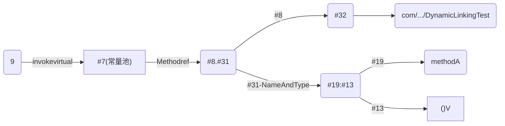
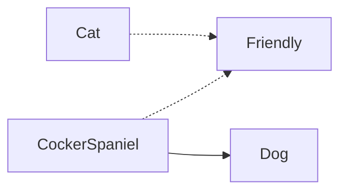

# 虚拟机栈概述

## 虚拟机栈出现的背景

由于跨平台性的设计，Java的指令是根据栈来设计的。不同平台的CPU架构不同，所以不能设计基于寄存器。

**优点是跨平台，指令集小，编译器容易实现，**

**缺点是性能下降，实现同样的功能需要更多的指令。**


## 初步印象

有不少Java开发人员一提到Java内存结构，就会非常粗粒度地将JVM中的内存区理解为仪有Java堆(heap)和Java栈(stack)？为什么？

## 内存中的堆和栈

**栈是运行时的单位，而堆是存储的单位。**

即：栈解决程序的运行问题，即程序如何执行，或者说如何处理数据。堆解决的是数据存储的问题，即数据怎么放，放在哪。

### 生活的例子-佛跳墙（做菜）

左侧为栈，右侧为堆。


## 虚拟机栈的基本内容

### Java虚拟机栈是什么？

Java虚拟机栈（Java virtual Machine stack），早期也叫Java栈。每个线程在创建时都会创建一个虚拟机栈，其内部保存一个个的栈帧
（Stack frame），对应着一次次的Java方法调用。是线程私有的。

### 生命周期

生命周期和线程一致。

### 作用

主管Java程序的运行，它保存方法的局部变量（8种基本数据类型、对象的引用地址）、部分结果，并参与方法的调用和返回。

局部变量 VS 成员变量（或属性）

基本数据变量 VS 引用类型变量（类，数组，接口）

### 虚拟机栈图


### 栈的特点（优点）

- 栈是一种快速有效的分配存储方式，访问速度仅次于程序计数器。
- JVM直接对Java栈的操作只有两个：
  - 每个方法执行，伴随着进栈(入栈、压栈)
  - 执行结束后的出栈工作
- 对于栈来说不存在垃圾回收问题

### 面试题：开发中遇到的异常有哪些？

> 栈中可能出现的异常

Java虚拟机规范允许**Java栈的大小是动态的或者是固定不变的。**

- 如果采用固定大小的Java虚拟机栈，那每一个线程的Java虚拟机栈容量可以在线程创建的时候独立选定。如果线程请求分配的栈容量超过Java虚拟机栈允许的最大容量，Java虚拟机将会抛出一个StackOverflowError异常。

- 如果Java虚拟机栈可以动态扩展，并且在尝试扩展的时候无法申请到足够的内存，或者在创建新的线程时没有足够的内存去创建对应的虚拟机栈，那Java虚拟机将会抛出一个 OutOfMemoryError异常。

#### Java虚拟机栈异常示例

> 通过 `-Xss`来设置虚拟机栈的大小，如：`java -Xss256k `
>
> [-Xss说明](https://docs.oracle.com/en/java/javase/11/tools/java.html#GUID-3B1CE181-CD30-4178-9602-230B800D4FAE) 搜索`-Xss`

```java
package com.chaocode.jvm.atguigu.chapter05;

/**
 * 虚拟机栈异常演示
 * 默认情况下：count : 11404
 * 设置栈的大小： -Xss256k : count : 2473
 *
 * @author Liqc
 * @date 2021/1/11 15:56
 */
public class StackErrorTest {

    static int num = 0;

    public static void main(String[] args) {
        num++;
        System.out.println(num);
        main(args);

    }

}
```


# 栈的存储单位

## 栈中存储的是什么？

- 每个线程都有自己的栈，栈中的数据都是以**栈帧（Stack frame）的格式存在**。
- 在这个线程上正在执行的每个方法都各自对应一个栈帧( Stack frame)
- 栈帧是一个内存区块，是一个数据集，维系着方法执行过程中的各种数据信息。


## 栈运行原理

- JVM直接对Java栈的操作只有两个，就是对栈帧的***压栈***和***出栈***，**遵循“先进后出”/“后进先出”原则**。
- 在一条活动线程中，一个时间点上，只会有一个活动的栈帧。即只有当前正在执行的方法的栈帧(栈顶栈帧)是有效的，这个栈帧被称为**当前栈帧(Current Frame)**，与当前栈帧相对应的方法就是**当前方法(Current Method)**，定义这个方法的类就是当**前类( Current Class)**
- 执行引擎运行的所有字节码指令只针对当前栈帧进行操作。
- 如果在该方法中调用了其他方法，对应的新的栈帧会被创建出来，放在栈的顶端，成为新的当前帧。
- 不同线程中所包含的栈帧是不允许存在相互引用的，即不可能在一个栈帧之中引用另外一个线程的栈帧。
- 如果当前方法调用了其他方法，方法返回之际，当前栈帧会传回此方法的执行结果给前一个栈帧，接着，虚拟机会丢弃当前栈帧，使得前一个栈帧重新成为当前栈帧。
- Java方法有两种返回函数的方式，**一种是正常的函数返回，使用 return指令;另外一种是抛出异常。不管使用哪种方式，都会导致栈帧被弹出。**


### 栈桢的两种结束方式

```java
package com.chaocode.jvm.atguigu.chapter05;

/**
 * 方法的结束方式分为两种：
 *  ① 正常结束，以return为代表
 *  ② 方法执行中出现未捕获处理的异常，以抛出异常的方式结束
 */
public class StackFrameTest {
    public static void main(String[] args) {
        try {
            StackFrameTest test = new StackFrameTest();
            test.method1();

        } catch (Exception e) {
            e.printStackTrace();
        }

        System.out.println("main()正常结束");

    }

    public void method1(){
        System.out.println("method1()开始执行...");
        method2();
        System.out.println("method1()执行结束...");
//        System.out.println(10 / 0);

//        return ;//可以省略
}

    public int method2() {
        System.out.println("method2()开始执行...");
        int i = 10;
        int m = (int) method3();
        System.out.println("method2()即将结束...");
        return i + m;
    }

    public double method3() {
        System.out.println("method3()开始执行...");
        double j = 20.0;
        System.out.println("method3()即将结束...");
        return j;
    }

}
```


## 栈桢的内部结构

每个栈桢中存储着

- **局部变量表（Local Variables）**
- **操作数栈（Operand Stack）（或表达式栈）**
- 动态链接（Dynamic Linking）（或指向运行时常量池的方法引用）
- 方法返回地址（Return Address）（或方法正常退出或者异常退出的定义）
- 一些附加信息

> 动态链接、方法返回地址、一些附加信息有时又统称为**桢数据区**

### 栈桢结构图一：


### 栈桢结构图二：


# 局部变量表（Local Variables）

## 概念

- 局部变量表也被称之为局部变量数组或本地变量表
- **定义为一个数字数组，主要用于存储方法参数和定义在方法体内的局部变量**，这些数据类型包括各类基木数据类型、对象引用(reference)，以及returnAddress类型。
- 由于局部变量表是建立在线程的栈上，是线程的私有数据，因此**不存在数据安全问题**
- **局部变量表所需的容量大小是在编译期确定下来的**，并保存在方法的code属性的maximum local variables数据项中。在方法运行期间是不会改变局部变量表的大小的。
- **方法嵌套调用的次数由栈的大小决定。**一般来说，**栈越大，方法嵌套调用次数越多。**对一个函数而言，它的参数和局部变量越多，使得局部变量表膨胀，它的栈帧就越大，以满足方法调用所需传递的信息增大的需求。进而函数调用就会占用更多的栈空间，导致其嵌套调用次数就会减少。
- **局部变量表中的变量只在当前方法调用中有效。**在方法执行时，虚拟机通过使用局部变量表完成参数值到参数变量列表的传递过程。**当方法调用结束后，随着方法栈帧的销毁，局部变量表也会随之销毁。**

## 图解

局部变量表-图1


> Code length: 表示字节码的大小。（Long，Double占两个位置（槽，Slot））


Main局部变量表-详情

```
  LocalVariableTable:
	Start  Length  Slot  Name   Signature
		0      16     0  args   [Ljava/lang/String;
		8       8     1  test   Lcom/chaocode/jvm/atguigu/chapter05/LocalVariablesTest;
	   11       5     2   num   I
```

> **由构造方法或实例方法创建的对象的方法的第一个槽（索引为0）是`this`对象参数。**
>
> Start：在字节码中作用开始的位置
>
> Length：作用长度
>
> Slot：槽，局部变量表中的索引位置。
>
> Name：参数名
>
> Signature：描述，类型表示，“[”：表示数组；“L”：表示引用类型，link；“I”：表示int类型；“J”：表示long类型。

代码行与字节码行的对应位置

```
LineNumberTable:
	line 13: 0
	line 14: 8
	line 15: 11
	line 16: 15
```

## 关于Slot的理解

- 参数值的存放总是在局部变量数组的 index0开始，到数组长度-1的索引结束。
- 局部变量表，最基本的存储单元是Slot(变量槽)
- 局部变量表中存放编译期可知的各种基本数据类型(8种)，引用类型(reference)， returnAddress类型的变量。
- 在局部变量表里，**32位以内的类型只占用一个slot(包括returnAddress类型)，64位的类型(long和 double)占用两个slot**。
  - byte、 short、char在存储前被转换为int， boolean也被转换为int，0表示false，非0表示true。
  - long和double则占据两个slot。
- JVM会为局部变量表中的每一个Slot都分配一个访问索引，通过这个索引即可成功访问到局部变量表中指定的局部变量值。
- 当一个实例方法被调用的时候，它的方法参数和方法体内部定义的局部变量将会**按照顺序被复制**到局部变量表中的每一个Slot上。

- 如果需要访问局部变量表中一个64bit的局部变量值时，只需要使用前一个索引即可。(比如:访问long或double类型变量)
- 如果当前帧是由构造方法或者实例方法创建的，那么**该对象引用this将会存放在index为0的slot处**，其余的参数按照参数表顺序继续排列

### 类型及占用长度

| 索引 | 类型      | 参数                    |
| ---- | --------- | ----------------------- |
| 0    | int       | int k                   |
| 1    | long      | long m 占2和3两个位置   |
| 2    |           |                         |
| 3    | float     | float p                 |
| 4    | double    | double q 占4和5两个位置 |
| 5    |           |                         |
| 6    | reference | Object t                |
|      |           |                         |

### this的理解

原代码

```java
    //练习：
    public static void testStatic(){
        LocalVariablesTest test = new LocalVariablesTest();
        Date date = new Date();
        int count = 10;
        System.out.println(count);
        //因为this变量不存在于当前方法的局部变量表中！！
//        System.out.println(this.count);
    }
```

`javap -verbose xx.class`反编译后

```
Constant pool:
   #1 = Class              #60            // com/chaocode/jvm/atguigu/chapter05/LocalVariablesTest
   #2 = Methodref          #1.#61         // com/chaocode/jvm/atguigu/chapter05/LocalVariablesTest."<init>":()V
   #3 = Methodref          #1.#62         // com/chaocode/jvm/atguigu/chapter05/LocalVariablesTest.test1:()V
   #4 = Class              #63            // java/util/Date
   #5 = Methodref          #4.#61         // java/util/Date."<init>":()V
   #6 = Fieldref           #64.#65        // java/lang/System.out:Ljava/io/PrintStream;
   #7 = Methodref          #66.#67        // java/io/PrintStream.println:(I)V
   #8 = Methodref          #21.#61        // java/lang/Object."<init>":()V
   #9 = Fieldref           #1.#68         // com/chaocode/jvm/atguigu/chapter05/LocalVariablesTest.count:I
  #10 = String             #69            // atguigu.com
  #11 = Methodref          #1.#70         // com/chaocode/jvm/atguigu/chapter05/LocalVariablesTest.test2:(Ljava/util/Date;Ljava/lang/String;)Ljava/lang/String;
  #12 = Class              #71            // java/lang/StringBuilder
  #13 = Methodref          #12.#61        // java/lang/StringBuilder."<init>":()V
  #14 = Methodref          #12.#72        // java/lang/StringBuilder.append:(Ljava/lang/Object;)Ljava/lang/StringBuilder;
  #15 = Methodref          #12.#73        // java/lang/StringBuilder.append:(Ljava/lang/String;)Ljava/lang/StringBuilder;
  #16 = Methodref          #12.#74        // java/lang/StringBuilder.toString:()Ljava/lang/String;
  #17 = Methodref          #66.#75        // java/io/PrintStream.println:(Ljava/lang/String;)V
  #18 = String             #76            // songhongkang
  #19 = Double             130.5d
  #21 = Class              #77            // java/lang/Object
  #22 = Utf8               count
  #23 = Utf8               I
  #24 = Utf8               main
  #25 = Utf8               ([Ljava/lang/String;)V
  #26 = Utf8               Code
  #27 = Utf8               LineNumberTable
  #28 = Utf8               LocalVariableTable
  #29 = Utf8               args
  #30 = Utf8               [Ljava/lang/String;
  #31 = Utf8               test
  #32 = Utf8               Lcom/chaocode/jvm/atguigu/chapter05/LocalVariablesTest;
  #33 = Utf8               num
  #34 = Utf8               testStatic
  #35 = Utf8               ()V
  #36 = Utf8               date
  #37 = Utf8               Ljava/util/Date;
  #38 = Utf8               <init>
  #39 = Utf8               this
  #40 = Utf8               test1
  #41 = Utf8               name1
  #42 = Utf8               Ljava/lang/String;
  #43 = Utf8               info
  #44 = Utf8               test2
  #45 = Utf8               (Ljava/util/Date;Ljava/lang/String;)Ljava/lang/String;
  #46 = Utf8               dateP
  #47 = Utf8               name2
  #48 = Utf8               weight
  #49 = Utf8               D
  #50 = Utf8               gender
  #51 = Utf8               C
  #52 = Utf8               test3
  #53 = Utf8               test4
  #54 = Utf8               b
  #55 = Utf8               a
  #56 = Utf8               c
  #57 = Utf8               test5Temp
  #58 = Utf8               SourceFile
  #59 = Utf8               LocalVariablesTest.java
  #60 = Utf8               com/chaocode/jvm/atguigu/chapter05/LocalVariablesTest
  #61 = NameAndType        #38:#35        // "<init>":()V
  #62 = NameAndType        #40:#35        // test1:()V
  #63 = Utf8               java/util/Date
  #64 = Class              #78            // java/lang/System
  #65 = NameAndType        #79:#80        // out:Ljava/io/PrintStream;
  #66 = Class              #81            // java/io/PrintStream
  #67 = NameAndType        #82:#83        // println:(I)V
  #68 = NameAndType        #22:#23        // count:I
  #69 = Utf8               atguigu.com
  #70 = NameAndType        #44:#45        // test2:(Ljava/util/Date;Ljava/lang/String;)Ljava/lang/String;
  #71 = Utf8               java/lang/StringBuilder
  #72 = NameAndType        #84:#85        // append:(Ljava/lang/Object;)Ljava/lang/StringBuilder;
  #73 = NameAndType        #84:#86        // append:(Ljava/lang/String;)Ljava/lang/StringBuilder;
  #74 = NameAndType        #87:#88        // toString:()Ljava/lang/String;
  #75 = NameAndType        #82:#89        // println:(Ljava/lang/String;)V
  #76 = Utf8               songhongkang
  #77 = Utf8               java/lang/Object
  #78 = Utf8               java/lang/System
  #79 = Utf8               out
  #80 = Utf8               Ljava/io/PrintStream;
  #81 = Utf8               java/io/PrintStream
  #82 = Utf8               println
  #83 = Utf8               (I)V
  #84 = Utf8               append
  #85 = Utf8               (Ljava/lang/Object;)Ljava/lang/StringBuilder;
  #86 = Utf8               (Ljava/lang/String;)Ljava/lang/StringBuilder;
  #87 = Utf8               toString
  #88 = Utf8               ()Ljava/lang/String;
  #89 = Utf8               (Ljava/lang/String;)V
{
……
……
  public void test1();
    descriptor: ()V
    flags: (0x0001) ACC_PUBLIC
    Code:
      stack=3, locals=4, args_size=1
         0: new           #4                  // class java/util/Date
         3: dup
         4: invokespecial #5                  // Method java/util/Date."<init>":()V
         7: astore_1
         8: ldc           #10                 // String atguigu.com
        10: astore_2
        11: aload_0
        12: aload_1
        13: aload_2
        14: invokevirtual #11                 // Method test2:(Ljava/util/Date;Ljava/lang/String;)Ljava/lang/String;
        17: astore_3
        18: getstatic     #6                  // Field java/lang/System.out:Ljava/io/PrintStream;
        21: new           #12                 // class java/lang/StringBuilder
        24: dup
        25: invokespecial #13                 // Method java/lang/StringBuilder."<init>":()V
        28: aload_1
        29: invokevirtual #14                 // Method java/lang/StringBuilder.append:(Ljava/lang/Object;)Ljava/lang/StringBuilder;
        32: aload_2
        33: invokevirtual #15                 // Method java/lang/StringBuilder.append:(Ljava/lang/String;)Ljava/lang/StringBuilder;
        36: invokevirtual #16                 // Method java/lang/StringBuilder.toString:()Ljava/lang/String;
        39: invokevirtual #17                 // Method java/io/PrintStream.println:(Ljava/lang/String;)V
        42: return
      LineNumberTable:
        line 34: 0
        line 35: 8
        line 36: 11
        line 37: 18
        line 38: 42
      LocalVariableTable:
        Start  Length  Slot  Name   Signature
            0      43     0  this   Lcom/chaocode/jvm/atguigu/chapter05/LocalVariablesTest;
            8      35     1  date   Ljava/util/Date;
           11      32     2 name1   Ljava/lang/String;
           18      25     3  info   Ljava/lang/String;
……
……
}
```

> 字节码中专门有一个地方叫常量池，最上面就是的`Constant pool`就是。运行起来后会把常量池存到运行时方法区中。


### Slot重复利用

**栈桢中的局部变量中的槽位是可以重用的**，如果一个局部变量过了其作用域，那么在其作用域后申明的新的局部变量就很有可能会复用过期局部变量的槽位，**从而达到节省资源的目的**。

源码

```java
public class SlotTest {
    public void localVarl() {
        int a = 0;
        System.out.println(a);
        int b = 0;
    }

    public void localVar2() {
        {
            int a = 0;
            System.out.println(a);
        }
        //此时的b就会复用a的槽位
        int b = 0;
    }
}
```

字节码

```
      LocalVariableTable:
        Start  Length  Slot  Name   Signature
            2       7     1     a   I
            0      12     0  this   Lcom/chaocode/jvm/atguigu/chapter05/SlotTest;
           11       1     1     b   I
```

> 从字节码中可以看出变量b与变量a的插槽位置一样，所以变量b直接使用的变量a的插槽。


## 举例：静态变量与局部变量对比

- 参数表分配完毕之后，再根据方法体内定义的变量的顺序和作用域分配。
- 我们知道类变量表有两次初始化的机会，第一次是在“**准备阶段**”，执行系统初始化，对类变量设置零值，另一次则是在“**初始化**”阶段，赋予程序员在代码中定义的初始值。
- 和类变量初始化不同的是，局部变量表不存在系统初始化的过程，这意味着一旦定义了局部变量则必须人为的初始化，否则无法使用。

```java
public void test() {
    int i;
    // 局部变量没有赋值，编译不通过，是无法使用的。
    System.out.println(i);
}
```


## 补充说明

- 在栈帧中，与性能调优关系最为密切的部分就是前面提到的局部变量表。在方法执行时，虚拟机使用局部变量表完成方法的传递。
- **局部变量表中的变量也是重要的垃圾回收根节点，只要被局部变量表中直接或间接引用的对象都不会被回收**。


# 操作数栈（Operand Stack）

- 每一个独立的栈帧中除了包含局部变量表以外，还包含一个**后进先出**(Last-In- First-0ut)的操作数栈，也可以称之为**表达式栈**（Expression Stack）

- **操作数栈，在方法执行过程中，根据字节码指令，往栈中写入数据或提取数据，即入栈(push)/出栈(pop)**。
  - 某些字节码指令将值压入操作数栈，其余的字节码指令将操作数取出栈。使用它们后再把结果压入栈。
  - 比如：执行复制、交换、求和等操作。

- 操作数栈，**主要用于保存计算过程的中间结果，同时作为计算过程中变量临时的存储空间**。
- 操作数栈就是JVM执行引擎的一个工作区，当一个方法刚开始执行的时候，个新的栈帧也会随之被创建出来，**这个方法的操作数栈是空的**。
- 每一个操作数栈都会拥有一个明确的栈深度用于存储数值，其所需的最大深度在编译期就定义好了，保存在方法的Code属性中，为 max_stack的值。
- 栈中的任何一个元素都是可以任意的Java数据类型。
  - 32bit的类型占用一个栈单位深度
  - 64bit的类型占用两个栈单位深度
- 操作数栈并非采用访问索引的方式来进行数据访问的，而是只能通过标准的入栈(push)和出栈(pop)操作来完成一次数据访问。

- **如果被调用的方法带有返回值的话，其返回值将会被压入当前栈帧的操作数栈中**，并更新PC寄存器中下一条需要执行的字节码指令。
- 操作数栈中元素的数据类型必须与字节码指令的序列严格匹配，这由编译器在编译器期间进行验证，同时在类加载过程中的类检验阶段的数据流分析阶段要再次验证。
- 另外，我们说Java虚拟机的**解释引擎是基于栈的执行引擎**，其中的栈指的就是操作数栈。

> 栈的数据结构可以是数组或链表，而操作数栈实际是使用数组实现的。

求各的操作数栈

| 求和前操作数栈 | 求各后操作数栈（Iadd执行后） |
| -------------- | ---------------------------- |
| 8              |                              |
| 15             | 23                           |
| 其它元素       | 其它元素                     |

代码

```java
    public void testAddOperation() {
        //byte、short、char、boolean：都以int型来保存
        byte i = 15;
        int j = 8;
        int k = i + j;

       // int m = 800;

    }
```

字节码

```
  public void testAddOperation();
    descriptor: ()V
    flags: (0x0001) ACC_PUBLIC
    Code:
      stack=2, locals=4, args_size=1
         0: bipush        15
         2: istore_1
         3: bipush        8
         5: istore_2
         6: iload_1
         7: iload_2
         8: iadd
         9: istore_3
        10: return
```


# 代码追踪

## 关于相加的代码追踪

代码

```java
    public void testAddOperation() {
        //byte、short、char、boolean：都以int型来保存
        byte i = 15;
        int j = 8;
        int k = i + j;
    }
```

`javap -verbose(-v) OperandStackTest.class`字节码

```
  public void testAddOperation();
    descriptor: ()V
    flags: (0x0001) ACC_PUBLIC
    Code:
      stack=2, locals=4, args_size=1
         0: bipush        15
         2: istore_1
         3: bipush        8
         5: istore_2
         6: iload_1
         7: iload_2
         8: iadd
         9: istore_3
        10: return
```


加载变量i


加载变量j


执行load操作


执行iadd操作并存储结果


## 关于使用数字类型

操作数栈会根据数值的实际大小来使用类型，存储的时候还是以指定的类型来存储

```java
    public void testAddOperation() {
        //byte、short、char、boolean：都以int型来保存
        byte i = 15;
        int j = 8;
        int k = i + j;

        int m = 800;
    }
```

字节码

```
 0 bipush 15
 2 istore_1
 3 bipush 8
 5 istore_2
 6 iload_1
 7 iload_2
 8 iadd
 9 istore_3
10 sipush 800
13 istore 4
15 return
```

> sipush 是push时以shot类型的数字


## 关于返回方法结果

代码

```java
    public int getSum(){
        int m = 10;
        int n = 20;
        int k = m + n;
        return k;
    }

    public void testGetSum(){
        //获取上一个栈桢返回的结果，并保存在操作数栈中
        int i = getSum();
        int j = 10;
    }
```

字节码

```
0 aload_0
1 invokevirtual #2 <com/chaocode/jvm/atguigu/chapter05/OperandStackTest.getSum>
4 istore_1
5 bipush 10
7 istore_2
8 return
```

> **0 aload_0**：获取上一个方法的返回结果，并保存在操作数栈中

## 面试题

常见的i++和++i的区别，放到字节码篇章时再介绍。


# 栈顶缓存（Top-of-Stack Cashing）技术

前面提过，基于栈式架构的虚拟机所使用的零地址指令更加紧凑，但完成一项操作的时候必然需要使用更多的入栈和出栈指令，这同时也就意
味着将需要更多的指令分派( instruction dispatch)次数和内存读/写次数。
由于操作数是存储在内存中的，因此频繁地执行内存读/写操作必然会影响执行速度。为了解决这个问题， HotSpot UVM的设计者们提出了栈顶缓存(ToS,Top-of-Stack Cashing)技术,**将栈顶元素全部缓存在物理CPU的寄存器中,以此降低对内存的读/写次数,提升执行引擎的执行效率**。


# 动态链接（Dynamic Linking）

> 动态链接（或指向运行时常量池的方法引用）

- 每一个栈帧内部都包含一个指向**运行时常量池**中**该栈帧所属方法的引用**。包含这个引用的目的就是为了支持当前方法的代码能够实现**动态链接（Dynamic Linking）**。比如: invokedynamic指令
- 在Java源文件被编译到字节码文件中时，所有的变量和方法引用都作为符号引用（Symbolic Reference）保存在 class 文件的常量池里。比如：描述一个方法调用了另外的其他方法时，就是通过常量池中指向方法的符号引用来表示的，那么**动态链接的作用就是为了将这些符号引用转换为调用方法的直接引用**。

## 例子

### 字节码

```
public class com.chaocode.jvm.atguigu.chapter05.DynamicLinkingTest
…………
Constant pool:
   #1 = Methodref          #9.#23         // java/lang/Object."<init>":()V
   #2 = Fieldref           #8.#24         // com/chaocode/jvm/atguigu/chapter05/DynamicLinkingTest.num:I
   #3 = Fieldref           #25.#26        // java/lang/System.out:Ljava/io/PrintStream;
   #4 = String             #27            // methodA()....
   #5 = Methodref          #28.#29        // java/io/PrintStream.println:(Ljava/lang/String;)V
   #6 = String             #30            // methodB()....
   #7 = Methodref          #8.#31         // com/chaocode/jvm/atguigu/chapter05/DynamicLinkingTest.methodA:()V
   #8 = Class              #32            // com/chaocode/jvm/atguigu/chapter05/DynamicLinkingTest
   #9 = Class              #33            // java/lang/Object
  #10 = Utf8               num
  #11 = Utf8               I
  #12 = Utf8               <init>
  #13 = Utf8               ()V
  #14 = Utf8               Code
  #15 = Utf8               LineNumberTable
  #16 = Utf8               LocalVariableTable
  #17 = Utf8               this
  #18 = Utf8               Lcom/chaocode/jvm/atguigu/chapter05/DynamicLinkingTest;
  #19 = Utf8               methodA
  #20 = Utf8               methodB
  #21 = Utf8               SourceFile
  #22 = Utf8               DynamicLinkingTest.java
  #23 = NameAndType        #12:#13        // "<init>":()V
  #24 = NameAndType        #10:#11        // num:I
  #25 = Class              #34            // java/lang/System
  #26 = NameAndType        #35:#36        // out:Ljava/io/PrintStream;
  #27 = Utf8               methodA()....
  #28 = Class              #37            // java/io/PrintStream
  #29 = NameAndType        #38:#39        // println:(Ljava/lang/String;)V
  #30 = Utf8               methodB()....
  #31 = NameAndType        #19:#13        // methodA:()V
  #32 = Utf8               com/chaocode/jvm/atguigu/chapter05/DynamicLinkingTest
  #33 = Utf8               java/lang/Object
  #34 = Utf8               java/lang/System
  #35 = Utf8               out
  #36 = Utf8               Ljava/io/PrintStream;
  #37 = Utf8               java/io/PrintStream
  #38 = Utf8               println
  #39 = Utf8               (Ljava/lang/String;)V
{
…………
  public void methodB();
    descriptor: ()V
    flags: (0x0001) ACC_PUBLIC
    Code:
      stack=3, locals=1, args_size=1
         0: getstatic     #3                  // Field java/lang/System.out:Ljava/io/PrintStream;
         3: ldc           #6                  // String methodB()....
         5: invokevirtual #5                  // Method java/io/PrintStream.println:(Ljava/lang/String;)V
         8: aload_0
         9: invokevirtual #7                  // Method methodA:()V
        12: aload_0
        13: dup
        14: getfield      #2                  // Field num:I
        17: iconst_1
        18: iadd
        19: putfield      #2                  // Field num:I
        22: return
…………
}
```

> **`9: invokevirtual #7`**：调用的是常量池中的**#7**

### 流程图



> #+数字都是表示常量池的索引ID


## 动态链接说明图


## 为什么需要常量池

常量池的作用，就是为了提供一些符号的常量，便于指令的识别。


# 方法的调用：解析与分派

在JVM中，将符号引用转换调用方法的直接引用与方法的绑定机制相关。

## 静态链接与动态链接

- 静态链接:

当一个字节码文件被装载进JVM内部时，如果被调用的**目标方法在编译期可知**，且运行期保持不变时。这种情况下将调用方法的符号引用转换为直接引用的过程称之为静态链接。

- 动态链接

如果**被调用的方法在编译期无法被确定下来**，也就是说，只能够在程序运行期将调用方法的符号引用转换为直接引用，由于这种引用转换过程具备动态性，因此也就被称之为动态链接。


## 早期绑定与晚期绑定

对应的方法的绑定机制为：早期绑定（Early Binding）和晚期绑定（Late Binding）。**绑定是一个字段、方法或者类在符号引用被替换为直接引用的过程，这仅仅发生一次**。

- 早期绑定
  早期绑定就是指被调用的**目标方法如果在编译期可知，且运行期保持不变时**，即可将这个方法与所属的类型进行绑定，这样一来，由于明确了被调用的目标方法究竟是哪一个，因此也就可以使用静态链接的方式将符号引用转换为直接引用。
- 晚期绑定
  如果**被调用的方法在编译期无法被确定下来，只能够在程序运行期根据实际的类型绑定相关的方法**，这种绑定方式也就被称之为晚期绑定。

## 例子

```java
/**
 * 说明早期绑定和晚期绑定的例子
 */
class Animal{

    public void eat(){
        System.out.println("动物进食");
    }
}

interface Huntable{
    void hunt();
}

class Dog extends Animal implements Huntable{
    @Override
    public void eat() {
        System.out.println("狗吃骨头");
    }

    @Override
    public void hunt() {
        System.out.println("捕食耗子，多管闲事");
    }
}

class Cat extends Animal implements Huntable{

    public Cat(){
        super();//表现为：早期绑定
    }

    public Cat(String name){
        this();//表现为：早期绑定
    }

    @Override
    public void eat() {
        super.eat();//表现为：早期绑定
        System.out.println("猫吃鱼");
    }

    @Override
    public void hunt() {
        System.out.println("捕食耗子，天经地义");
    }
}
public class AnimalTest {
    public void showAnimal(Animal animal){
        animal.eat();//表现为：晚期绑定
    }
    public void showHunt(Huntable h){
        h.hunt();//表现为：晚期绑定
    }
}
```


## 虚方法与非虚方法

随着高级语言的横空出世，类似于Java一样的基于面向对象的编程语言如今越来越多，尽管这类编程语言在语法风格上存在一定的差别，但是它们彼此之间始终保持着一个共性，那就是都攴持封装、继承和多态等面向对象特性，既然**这一类的编程语言具备多态特性，那么自然也就具备早期绑定和晚期绑定两种绑定方式**。
Java中任何一个普通的方法其实都具备虚函数的特征，它们相当于C++语言中的虚函数（C++中则需要使用关键字 virtual来显式定义）。如果在Java程序中不希望某个方法拥有虚函数的特征时，则可以使用关键字final来标记这个方法。

### 非虚方法

> 子类对象的多态性的使用前提：①类的继承关系 ②方法的重写

- 如果方法在编译期就确定了具体的调用版本，这个版木在运行时是不可变的。这样的方法称为**非虚方法**。
- 静态方法、私有方法、final方法、实例构造器、父类方法都是非虚方法。
- 其他方法称为虚方法。

### 虚方法举例

在类加载的解析阶段就可以进行解析，如下是非虚方法举例：

```java
class Father {
    public static void print(Stirng str) {
        System.out.println("father " + str);
    }
	private void show(Stirng str) {
        System.out.println("father " + str);
    }
}

class son extends Father {
    
}

public class VirtualMethodTest {
    public static void main(String[] args) {
        Son.Pring("coder");
        // Father fa = new Father();
        // fa.show("baidu.com");
    }
}
```


## 调用指令

虚拟机中提供了以下几条方法调用指令：

- 普通调用指令：

1. **invokestatic：调用静态方法，解析阶段确定唯一方法版本**
2. **invokespecial：调用\<init>方法、私有及父类方法，解析阶段确定唯一方法版本**
3. invokevirtual：调用所有虚方法
4. invokeinterface：调用接口方法

- 动态调用指令：

5. invokedynamic：动态解析出需要调用的方法，然后执行

前四条指令固化在虚拟机内部，方法的调用执行不可人为千预，而 invokedynamic指令则支持由用户确定方法版本。**其中 invokestatic指令和 invokespecial指令调用的方法称为非虚方法，其余的（final修饰的除外）称为虚方法。**

### 指令例子

```java
/**
 * 解析调用中非虚方法、虚方法的测试
 * invokestatic指令和invokespecial指令调用的方法称为非虚方法
 */
class Father {
    public Father() {
        System.out.println("father的构造器");
    }

    public static void showStatic(String str) {
        System.out.println("father " + str);
    }

    public final void showFinal() {
        System.out.println("father show final");
    }

    public void showCommon() {
        System.out.println("father 普通方法");
    }
}

public class Son extends Father {
    public Son() {
        //invokespecial
        super();
    }
    public Son(int age) {
        //invokespecial
        this();
    }
    //不是重写的父类的静态方法，因为静态方法不能被重写！
    public static void showStatic(String str) {
        System.out.println("son " + str);
    }
    private void showPrivate(String str) {
        System.out.println("son private" + str);
    }

    public void show() {
        //invokestatic
        showStatic("atguigu.com");
        //invokestatic
        super.showStatic("good!");
        //invokespecial
        showPrivate("hello!");
        //invokespecial
        super.showCommon();

        //invokevirtual
        showFinal();//因为此方法声明有final，不能被子类重写，所以也认为此方法是非虚方法。
        //虚方法如下：
        //invokevirtual
        showCommon();
        info();

        MethodInterface in = null;
        //invokeinterface
        in.methodA();
    }

    public void info(){

    }

    public void display(Father f){
        f.showCommon();
    }

    public static void main(String[] args) {
        Son so = new Son();
        so.show();
    }
}

interface MethodInterface{
    void methodA();
}
```

### 关于invokedynamic指令

- JVM字节码指令集一直比较稳定，一直到Java7中才增加了一个invokedynamic指令，**这是Java为了实现「动态类型语言」支持而做的种改进。**

- 但是在Java7中并没有提供直接生成 invokedynamic指令的方法，需要借助ASM这种底层字节码工具来产生 invokedynamic指令。**直到Java8的 Lambda表达式的出现， invokedynamic指令的生成，在Java中才有了直接的生成方式。**

- Java7中增加的动态语言类型支持的本质是对Java虚拟机规范的修改，而不是对Java语言规则的修改，这一块相对来讲比较复杂，增加了虚拟机中的方法调用，最直接的受益者就是运行在Java平台的动态语言的编译器。


### 动态类型语言和静态类型语言

- 动态类型语言和静态类型语言两者的区别就在于对类型的检査是在编译期还是在运行期，满足前者就是静态类型语言，反之是动态类型语言。
- 说的再直白一点就是，**静态类型语言是判断变量自身的类型信息；动态类型语言是判断变量值的类型信息，变量没有类型信息，变量值才有类型信息**，这是动态语言的一个重要特征。

```java
// Java 属于静态类型语言
String info = "info";

// js，jdk9开始也支持var定义变量。
var name = "info";
var age = 10;

// python
info = 105.3
```

### invokedynamic例子

代码

```java
/**
 * 体会invokedynamic指令
 */
@FunctionalInterface
interface Func {
    boolean func(String str);
}

public class Lambda {
    public void lambda(Func func) {
        return;
    }

    public static void main(String[] args) {
        Lambda lambda = new Lambda();

        Func func = s -> true;

        lambda.lambda(func);

        lambda.lambda(s -> {
            return true;
        });
    }
}
```

字节码

```java
 0 new #2 <com/chaocode/jvm/atguigu/chapter05/Lambda>
 3 dup
 4 invokespecial #3 <com/chaocode/jvm/atguigu/chapter05/Lambda.<init>>
 7 astore_1
 8 invokedynamic #4 <func, BootstrapMethods #0>
13 astore_2
14 aload_1
15 aload_2
16 invokevirtual #5 <com/chaocode/jvm/atguigu/chapter05/Lambda.lambda>
19 aload_1
20 invokedynamic #6 <func, BootstrapMethods #1>
25 invokevirtual #5 <com/chaocode/jvm/atguigu/chapter05/Lambda.lambda>
28 return
```

## 方法重写的本质

Java语言中方法重写的本质：

1. 找到操作数栈顶的第一个元素所执行的对象的实际类型，记作 C 。
2. 如果在类型 C 中找到与常量中的描述符合简单名称都相符的方法，则进行访问权限校验，如果通过则返回这个方法的直接引用，查找过程结束;如果不通过，则返回`java.lang.IllegalAccessError`异常。
3. 否则，按照继承关系从下往上依次对C的各个父类进行第2步的搜素和验证过程。
4. 如果始终没有找到合适的方法，则抛出`java.lang.AbstractMethodError`异常。

IllegalAccessError介绍:

- 程序试图访问或修改一个属性或调用一个方法，这个属性或方法，你没有权限访问。一般的，这个会引起编译器异常。这个错误如果发生在运行时，就说明一个类发生了不兼容的改变。

## 虚方法表

- 在面向对象的编程中，会很频繁的使用到动态分派，如果在每次动态分派的过程中都要重新在类的方法元数据中搜索合适的目标的话就可能影响到执行效率。因此，**为了提高性能**，JVM采用在类的方法区建立一个虚方法表**（virtual method table）（非虚方法不会出现在表中）来实现。使用索引表来代替查找。**

- 每个类中都有一个虚方法表，表中存放着各个方法的实际入口。
- 那么虚方法表什么时候被创建?
  - 虚方法表会在类加载的链接阶段被创建并开始初始化，类的变量初始值准备完成之后，JVM会把该类的方法表也初始化完毕。

### 图解1


### 图解2



> Cocker Spaniel：可卡犬

### 虚方法表代码示例

```java
/**
 * 虚方法表的举例
 */
interface Friendly {
    void sayHello();
    void sayGoodbye();
}
class Dog {
    public void sayHello() {
    }
    public String toString() {
        return "Dog";
    }
}
class Cat implements Friendly {
    public void eat() {
    }
    public void sayHello() {
    }
    public void sayGoodbye() {
    }
    protected void finalize() {
    }
    public String toString(){
        return "Cat";
    }
}

class CockerSpaniel extends Dog implements Friendly {
    public void sayHello() {
        super.sayHello();
    }
    public void sayGoodbye() {
    }
}

public class VirtualMethodTable {
}
```

### 虚方法表的调用过程


# 方法的返回地址（Return Address）

## 概念

- 存放调用该方法的pc寄存器的值。
- 一个方法的结束，有两种方式：
  - 正常执行完成
  - 出现未处理的异常，非正常退出
- 无论通过哪种方式退出，在方法退出后都返回到该方法被调用的位置。方法正常退出时，**调用者的pc计数器的值作为返回地址，即调用该方法的指令的下一条指令的地址。**而通过异常退出的，返回地址是要通过异常表来确定，栈帧中一般不会保存这部分信息。

- 当一个方法开始执行后，只有两种方式可以退出这个方法：

1. 执行引擎遇到任意一个方法返回的字节码指令（return），会有返回值传递给上层的方法调用者，简称**正常完成出口**

   - 一个方法在正常调用完成之后究竟需要使用哪一个返回指令还需要根据方法返回值的实际数据类型而定。

   - 在字节码指令中，返回指令包含 ireturn(当返回值是 boolean、byte、char、short和int类型时使用)、lreturn、 freturn、 dreturn以及 areturn，另外还有一个 return指令供声明为void的方法、实例初始化方法、类和接口的初始化方法使用。

2. 在方法执行的过程中遇到了异常（Exception），并且这个异常没有在方法内进行处理，也就是只要在本方法的异常表中没有搜索到匹配的异常处理器，就会导致方法退出。简称**异常完成出口**。
   - 方法执行过程中抛出异常时的异常处理，存储在一个异常处理表，方便在发生异常的时候找到处理异常的代码。

- 本质上，方法的退出就是当前栈帧出栈的过程。此时，需要恢复上层方法的局部变量表、操作数栈、将返回值压入调用者栈帧的操作数栈、设置PC寄存器值等，让调用者方法继续执行下去。
- **正常完成出口和异常完成出口的区别在于：通过异常完成出口退出的不会给他的上层调用者产生任何的返回值。**


## 两种退出方式

### 代码示例

```java
    public void method2() {

        methodVoid();

        try {
            method1();
        } catch (IOException e) {
            e.printStackTrace();
        }
    }

    public void method1() throws IOException {
        FileReader fis = new FileReader("douPoCangQiong.txt");
        char[] cBuffer = new char[1024];
        int len;
        while ((len = fis.read(cBuffer)) != -1) {
            String str = new String(cBuffer, 0, len);
            System.out.println(str);
        }
        fis.close();
    }
```

### method2的Exception table:

```java
      Exception table:
         from    to  target type
             4     8    11   Class java/io/IOException
```

> from 4对应method中的`methond()`
>
> from 8对应method中的`e.printStackTrace();`下一行的 “}”


## 字节码的return方式

代码

```java
    public boolean methodBoolean() {
        // ireturn
        return false;
    }

    public byte methodByte() {
        // ireturn
        return 0;
    }

    public short methodShort() {
        // ireturn
        return 0;
    }

    public char methodChar() {
        // ireturn
        return 'a';
    }

    public int methodInt() {
        // ireturn
        return 0;
    }

    public long methodLong() {
        // lreturn
        return 0L;
    }

    public float methodFloat() {
        // freturn
        return 0.0f;
    }

    public double methodDouble() {
        // dreturn
        return 0.0;
    }

    public String methodString() {
        // areturn
        return null;
    }

    public Date methodDate() {
        // areturn
        return null;
    }

    public void methodVoid() {
        // return 代码中可以省略return的写法，在字节码中还会加上。
    }
```


# 一些附加信息

栈桢中还允许与Java虚拟机实现相关的一些附加信息。例如，对程序调试提供支持的信息。


# 栈的相关面试题

- 举例栈溢出的情况?

可以通过`-Xss`设置栈的大小，如：`-Xss100m` 来设置栈的大小为100m。太小，方法调用链过长时会OOM异常。

会发生Error和GC的区域总结。

| 区域       | 会不会发生Error | 会不会产生GC |
| ---------- | --------------- | ------------ |
| 程序计数器 | N               | N            |
| 虚拟机栈   | Y               | N            |
| 本地方法栈 | Y               | N            |
| 堆         | Y               | Y            |
| 方法区     | Y               | Y            |


- 调整栈大小,就能保证不出现溢出吗?

不能

- 分配的栈内存越大越好吗?

不是

- 垃圾回收是否会涉及到虚拟机栈?

不会的

- 方法中定义的局部变量是否线程安全?

具体问题具体分析。**在不共享数据的情况下，线程是安全的。**

代码分析

```java
/**
 * 面试题：
 * 方法中定义的局部变量是否线程安全？具体情况具体分析
 *
 *   何为线程安全？
 *      如果只有一个线程才可以操作此数据，则必是线程安全的。
 *      如果有多个线程操作此数据，则此数据是共享数据。如果不考虑同步机制的话，会存在线程安全问题。
 */
public class StringBuilderTest {

    int num = 10;

    //s1的声明方式是线程安全的
    public static void method1(){
        //StringBuilder:线程不安全
        StringBuilder s1 = new StringBuilder();
        s1.append("a");
        s1.append("b");
        //...
    }
    //sBuilder的操作过程：是线程不安全的
    public static void method2(StringBuilder sBuilder){
        sBuilder.append("a");
        sBuilder.append("b");
        //...
    }
    //s1的操作：是线程不安全的
    public static StringBuilder method3(){
        StringBuilder s1 = new StringBuilder();
        s1.append("a");
        s1.append("b");
        return s1;
    }
    //s1的操作：是线程安全的
    public static String method4(){
        StringBuilder s1 = new StringBuilder();
        s1.append("a");
        s1.append("b");
        return s1.toString();
    }

    public static void main(String[] args) {
        StringBuilder s = new StringBuilder();


        new Thread(() -> {
            s.append("a");
            s.append("b");
        }).start();

        method2(s);

    }

}
```

