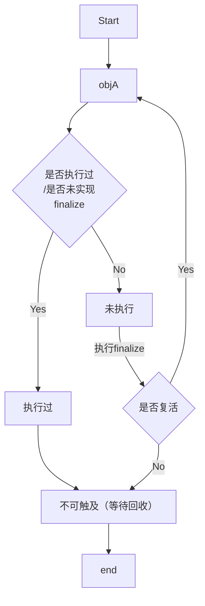

# 标记阶段：引用计数算法

## 垃圾标记阶段：对象存活判断

> 人活着就是要不断被需要，当没有了需要的价值，也就没有了活着的欲望。

- 在堆里存放着几乎所有的Java对象实例，在GC执行垃圾回收之前，首先**需要区分出内存中哪些是存活对象，哪些是已经死亡的对象。**只有被标记为己经死亡的对象，GC才会在执行垃圾回收时，释放掉其所占用的内存空间，因此这个过程我们可以称为**垃圾标记阶段**。
- 那么在JVM中究竟是如何标记一个死亡对象呢？简单来说，当一个对象已经不再被任何的存活对象继续引用时，就可以宣判为已经死亡。
- 判断对象存活一般有两种方式：**引用计数算法**和**可达性分析算法**。

## 方式一：引用计数算法

- 引用计数算法（Reference Counting）比较简单，对每个对象保存一个**整型的引用计数器属性。用于记录对象被引用的情况**。
- 对于一个对象A，只要有任何一个对象引用了A，则A的引用计数器就加1;当引用失效时，引用计数器就减1。只要对象A的引用计数器的值为0，即表示对象A不可能再被使用，可进行回收。
- 优点：
  - **实现简单，垃圾对象便于辨识；判定效率高，回收没有延迟性。**
- 缺点：
  - 它需要单独的字段存储计数器，这样的做法**增加了存储空间的开销**。
  - 每次赋值都需要更新计数器，伴随着加法和减法操作，这**增加了时间开销**。
  - 引用计数器有一个严重的问题，即**无法处理循环引用的情况**。这是一条致命缺陷，导致在Java的垃圾回收器中没有使用这类算法。

### 循环引用问题

所以Java没有引用该算法。


## 代码实践-Java未使用引用计数算法

测试一

```java
/**
 * -XX:+PrintGCDetails
 * 证明：java使用的不是引用计数算法
 * 
 * @author shkstart
 * @create 2020 下午 2:38
 */
public class RefCountGC {
    //这个成员属性唯一的作用就是占用一点内存
    private byte[] bigSize = new byte[5 * 1024 * 1024];//5MB

    Object reference = null;

    public static void main(String[] args) {
        RefCountGC obj1 = new RefCountGC();
        RefCountGC obj2 = new RefCountGC();

        obj1.reference = obj2;
        obj2.reference = obj1;

        obj1 = null;
        obj2 = null;
        //显式的执行垃圾回收行为
        //这里发生GC，obj1和obj2能否被回收？
//        System.gc();
    }
}
```


如果使用引用计数算法的话，如果不小心直接把obj1-reference和obj2-reference置null。则在Java堆当中的两块内存依然保持着互相引用，无法回收。


执行结果

新生代占用大概17.68M

```shell
Heap
 PSYoungGen      total 76288K， used 18105K [0x000000076b300000， 0x0000000770800000， 0x00000007c0000000)
  eden space 65536K， 27% used [0x000000076b300000，0x000000076c4ae428，0x000000076f300000)
  from space 10752K， 0% used [0x000000076fd80000，0x000000076fd80000，0x0000000770800000)
  to   space 10752K， 0% used [0x000000076f300000，0x000000076f300000，0x000000076fd80000)
 ParOldGen       total 175104K， used 0K [0x00000006c1800000， 0x00000006cc300000， 0x000000076b300000)
  object space 175104K， 0% used [0x00000006c1800000，0x00000006c1800000，0x00000006cc300000)
 Metaspace       used 3305K， capacity 4496K， committed 4864K， reserved 1056768K
  class space    used 359K， capacity 388K， committed 512K， reserved 1048576K
```

打开`System.gc();`执行结果

执行YoungGC和Full GC后，新生代只有655K，老年代使用了1M多点。所以那两个5M的对象已经回收了，不存在内存泄漏（循环引用无法回收）的问题。

```shell
[GC (System.gc()) [PSYoungGen: 16793K->1208K(76288K)] 16793K->1216K(251392K)， 0.0016486 secs] [Times: user=0.00 sys=0.00， real=0.00 secs] 
[Full GC (System.gc()) [PSYoungGen: 1208K->0K(76288K)] [ParOldGen: 8K->1067K(175104K)] 1216K->1067K(251392K)， [Metaspace: 3299K->3299K(1056768K)]， 0.0070375 secs] [Times: user=0.00 sys=0.00， real=0.01 secs] 
Heap
 PSYoungGen      total 76288K， used 655K [0x000000076b300000， 0x0000000770800000， 0x00000007c0000000)
  eden space 65536K， 1% used [0x000000076b300000，0x000000076b3a3ee8，0x000000076f300000)
  from space 10752K， 0% used [0x000000076f300000，0x000000076f300000，0x000000076fd80000)
  to   space 10752K， 0% used [0x000000076fd80000，0x000000076fd80000，0x0000000770800000)
 ParOldGen       total 175104K， used 1067K [0x00000006c1800000， 0x00000006cc300000， 0x000000076b300000)
  object space 175104K， 0% used [0x00000006c1800000，0x00000006c190ad20，0x00000006cc300000)
 Metaspace       used 3307K， capacity 4496K， committed 4864K， reserved 1056768K
  class space    used 359K， capacity 388K， committed 512K， reserved 1048576K
```


### 结论

循环对象可以回收，说话Java未使用引用计数算法。


## 小结

- 引用计数算法，是很多语言的资源回收选择，例如因人工智能而更加火热的 Python，它更是同时支持引用计数和垃圾收集机制。
- 具体哪种最优是要看场景的，业界有大规模实践中仅保留引用计数机制，以提高吞吐量的尝试
- **Java并没有选择引用计数**，是因为其存在一个基本的难题，也就是很难处理循环引用关系。
- Python如何解决循环引用？
  - 手动解除：很好理解，就是在合适的时机，解除引用关系。
  - 使用弱引用 weakref， weakref是 Python提供的标准库，旨在解决循环引用。


# 标记阶段：可达性分析算法

## 方式二：可达性分析（或根搜索算法、追踪性垃圾收集）

- 相对于引用计数算法而言，可达性分析算法不仅同样具备实现简单和执行高效等特点，更重要的是该算法可以**有效地解决在引用计数算法中循环引用的问题，防止内存泄漏的发生**。
- 相较于引用计数算法，这里的可达性分析就是Java、C#选择的。这种类型的垃圾收集通常也叫作**追踪性垃圾收集**（Tracing Garbage Collection）。

- 所谓"GC Roots"根集合就是一组必须活跃的引用。
- 基本思路：（标记可达的为存活对象，其它的对象为垃圾对象，直接回收。）
  - 可达性分析算法是以根对象集合（GC Roots）为起始点，按照从上至下的方式**搜索被根对象集合所连接的目标对象是否可达**。
  - 使用可达性分析算法后，内存中的存活对象都会被根对象集合直接或间接连接着，搜索所走过的路径称为**引用链（Reference chain）**。
  - 如果目标对象没有任何引用链相连，则是不可达的，就意味着该对象己经死亡，可以标记为垃圾对象。
  - 在可达性分析算法中，只有**能够被根对象集合直接或者间接连接的对象才是存活对象**。

可达性分析，这个算法目前较为常用。


## △GC Rroots

> 至少要记住前4个

在Java语言中， 能作为GC Roots的，包括以下几类元素：

- 虚拟机栈中引用的对象
  - 比如：各个线程被调用的方法中使用到的参数、局部变量等。
- 本地方法栈内JNI（通常说的本地方法）引用的对象
- 方法区中类静态属性引用的对象
  - 比如：Java类的引用类型静态变量
- 方法区中常量引用的对象
  - 比如：字符串常量池（String Table）里的引用
- 所有被同步锁 synchronized 持有的对象
- Java虚拟机内部的引用。
  - 基本数据类型对应的Class对象，一些常驻的异常对象（如：NullPointerException、 OutOfMemoryError），系统类加载器。
- 反映java虛拟机内部情况的 JMXBean、JVMTI中注册的回调、本地代码缓存等。

- 除了这些固定的 GC Roots集合以外，根据用户所选用的垃圾收集器以及当前回收的内存区域不同，还可以有其他对象“临时性”地加入，共同构成完整 GC Roots集合。比如：分代收集和局部回收（Partial GC）。
  - 如果只针对Java堆中的某一块区域进行垃圾回收（比如:典型的只针对新生代），必须考虑到内存区域是虚拟机自己的实现细节，更不是孤立封闭的，这个区域的对象完全有可能被其他区域的对象所引用，这时候就需要一并将关联的区域对象也加入GC Roots集合中去考虑，才能保证可达性分析的准确性。如：回收Young区时，可以使用Old区的对象作为GC Roots使用等。）
- 小技巧：
  由于Root采用栈方式存放变量和指针，所以如果一个指针，它保存了堆内存里面的对象，但是自己又不存放在堆内存里面，那它就是一个Root。


## 注意

- 如果要使用可达性分析算法来判断内存是否可回收，那么分析工作必须在个能保障一致性的快照中进行。这点不满足的话分析结果的准确性就无法保证。
- 这点也是导致GC进行时必须”Stop The World“的一个重要原因。
  - 即使是号称（几乎）不会发生停顿的CMS收集器（实为回收线程与用户线程交替执行）中，**枚举根节点时也是必须要停顿的**。


# 对象的finalization机制

`java.lang.Object#finalize`方法

```java
    /**
     * Called by the garbage collector on an object when garbage collection
     * determines that there are no more references to the object.
     * A subclass overrides the {@code finalize} method to dispose of
     * system resources or to perform other cleanup.
     * <p>
     * The general contract of {@code finalize} is that it is invoked
     * if and when the Java&trade; virtual
     * machine has determined that there is no longer any
     * means by which this object can be accessed by any thread that has
     * not yet died， except as a result of an action taken by the
     * finalization of some other object or class which is ready to be
     * finalized. The {@code finalize} method may take any action， including
     * making this object available again to other threads; the usual purpose
     * of {@code finalize}， however， is to perform cleanup actions before
     * the object is irrevocably discarded. For example， the finalize method
     * for an object that represents an input/output connection might perform
     * explicit I/O transactions to break the connection before the object is
     * permanently discarded.
     * <p>
     * The {@code finalize} method of class {@code Object} performs no
     * special action; it simply returns normally. Subclasses of
     * {@code Object} may override this definition.
     * <p>
     * The Java programming language does not guarantee which thread will
     * invoke the {@code finalize} method for any given object. It is
     * guaranteed， however， that the thread that invokes finalize will not
     * be holding any user-visible synchronization locks when finalize is
     * invoked. If an uncaught exception is thrown by the finalize method，
     * the exception is ignored and finalization of that object terminates.
     * <p>
     * After the {@code finalize} method has been invoked for an object， no
     * further action is taken until the Java virtual machine has again
     * determined that there is no longer any means by which this object can
     * be accessed by any thread that has not yet died， including possible
     * actions by other objects or classes which are ready to be finalized，
     * at which point the object may be discarded.
     * <p>
     * The {@code finalize} method is never invoked more than once by a Java
     * virtual machine for any given object.
     * <p>
     * Any exception thrown by the {@code finalize} method causes
     * the finalization of this object to be halted， but is otherwise
     * ignored.
     *
     * @throws Throwable the {@code Exception} raised by this method
     * @see java.lang.ref.WeakReference
     * @see java.lang.ref.PhantomReference
     * @jls 12.6 Finalization of Class Instances
     */
    protected void finalize() throws Throwable { }
```


- Java语言提供了对象终止（finalization）机制来允许开发人员提供**对象被销毁之前的自定义处理逻辑**。
- 当垃圾回收器发现没有引用指向一个对象，即：垃圾回收此对象之前，总会先调用这个对象的finalize()方法。
- finalize()方法允许在子类中被重写，**用于在对象被回收时进行资源释放**。通常在这个方法中进行一些资源释放和清理的工作，比如关闭文件、套接字和数据库连接等。

- 永远不要主动调用某个对象的finalize()方法，应该交给垃圾回收机制调用。理由包括下面三点：
  - 在finalize()时可能会导致对象复活。
  - finalize()方法的执行时间是没有保障的，它完全由GC线程决定，极端情况下，若不发生GC，则finalize()方法将没有执行机会。
  - 一个糟糕的finalize()会严重影响GC的性能。
- 从功能上来说，**finalize()方法与c++中的析构函数比较相似**，但是Java采用的是基于垃圾回收器的自动内存管理机制，所以 finalize()方法在本质上不同于C++中的析构函数。
- 由于finalize()方法的存在，**虚拟机中的对象一般处于三种可能的状态**。

- 如果从所有的根节点都无法访问到某个对象，说明对象己经不再使用了。一般来说，此对象需要被回收。但事实上，也并非是“非死不可”的，这时候它们暂时处于“缓刑”阶段。**一个无法触及的对象有可能在某一个条件下“复活”自己**，如果这样，那么对它的回收就是不合理的，为此，定义虚拟机中的对象可能的三种状态。如下:
  - **可触及的**：从根节点开始，可以到达这个对象。
  - **可复活的**：对象的所有引用都被释放，但是对象有可能在finalize()中复活。
  - **不可触及的**：对象的finalize()被调用，并且没有复活，那么就会进入不可触及状态。不可触及的对象不可能被复活，因为**finalize()只会被调用一次**。
- 以上3种状态中，是由于finalize()方法的存在，进行的区分。只有在对象不可触及时才可以被回收。

## Finalize方法执行流程

判定一个对象objA是否可回收，至少要经历两次标记过程：

1. 如果对象objA到 GC Roots没有引用链，则进行第一次标记。
2. 进行筛选，判断此对象是否有必要执行 finalize()方法
   ① 如果对象objA没有重写finalize()方法，或者finalize()方法已经被虚拟机调用过，则虚拟机视为“没有必要执行”，objA被判定为不可触及的。
   ② 如果对象obj重写了finalize()方法，且还未执行过，那么objA会被插入到F-Queue队列中，由一个虚拟机自动创建的、低优先级的Finalizer线程触发其finalize()方法执行。
   ③ **finalize()方法是对象逃脱死亡的最后机会**，稍后GC会对F-queue队列中的对象进行第二次标记。如果objA在finalize()方法中与引用链上的任何一个对象建立了联系，那么在第二次标记时，objA会被移出“即将回收”集合。之后，对象会再次出现没有引用存在的情况。在这个情况下，finalize方法不会被再次调用，对象会直接变成不可触及的状态，也就是说，一个对象的finalize方法只会被调用一次。



## 代码测试

### 查看Finalizer线程

```java
/**
 * -XX:+PrintGCDetails
 * 证明：java使用的不是引用计数算法
 *
 * @author shkstart
 * @create 2020 下午 2:38
 */
public class RefCountGC {
    //这个成员属性唯一的作用就是占用一点内存
    private byte[] bigSize = new byte[5 * 1024 * 1024];//5MB

    Object reference = null;

    public static void main(String[] args) {
        RefCountGC obj1 = new RefCountGC();
        RefCountGC obj2 = new RefCountGC();

        obj1.reference = obj2;
        obj2.reference = obj1;

        obj1 = null;
        obj2 = null;
        //显式的执行垃圾回收行为
        //这里发生GC，obj1和obj2能否被回收？
        System.gc();

        try {
            Thread.sleep(1000000);
        } catch (InterruptedException e) {
            e.printStackTrace();
        }
    }
}
```


### 在finalize中复活对象

```java
/**
 * 测试Object类中finalize()方法，即对象的finalization机制。
 *
 * @author shkstart
 * @create 2020 下午 2:57
 */
public class CanReliveObj {
    public static CanReliveObj obj;//类变量，属于 GC Root


    //此方法只能被调用一次
    @Override
    protected void finalize() throws Throwable {
        super.finalize();
        System.out.println("调用当前类重写的finalize()方法");
        obj = this;//当前待回收的对象在finalize()方法中与引用链上的一个对象obj建立了联系
    }


    public static void main(String[] args) {
        try {
            obj = new CanReliveObj();
            // 对象第一次成功拯救自己
            obj = null;
            System.gc();//调用垃圾回收器
            System.out.println("第1次 gc");
            // 因为Finalizer线程优先级很低，暂停2秒，以等待它
            Thread.sleep(2000);
            if (obj == null) {
                System.out.println("obj is dead");
            } else {
                System.out.println("obj is still alive");
            }
            System.out.println("第2次 gc");
            // 下面这段代码与上面的完全相同，但是这次自救却失败了
            obj = null;
            System.gc();
            // 因为Finalizer线程优先级很低，暂停2秒，以等待它
            Thread.sleep(2000);
            if (obj == null) {
                System.out.println("obj is dead");
            } else {
                System.out.println("obj is still alive");
            }
        } catch (InterruptedException e) {
            e.printStackTrace();
        }
    }
}
```

在调用第一次GC后，会在finalize方法复活对象，但是finalize方法只会调用一次，所以第二次GC的时候就回收了。结果如下：

```shell
第1次 gc
调用当前类重写的finalize()方法
obj is still alive
第2次 gc
obj is dead
```


# MAT与JProfiler的GC Roots的溯源

## 安装MAT分析软件

MAT是 Memory Analyzer 的简称，它是一款功能强大的Java堆内存分析器。
用于査找内存泄漏以及查看内存消耗情况。
MAT是基于 Eclipse开发的，是一款免费的性能分析工具。
大家可以在[http://www.eclipse.org/mat/](http://www.eclipse.org/mat/)下载并使用MAT。

## 获取dump文件

```java
import java.util.ArrayList;
import java.util.Date;
import java.util.List;
import java.util.Scanner;

/**
 * @author shkstart  shkstart@126.com
 * @create 2020  16:28
 */
public class GCRootsTest {
    public static void main(String[] args) {
        List<Object> numList = new ArrayList<>();
        Date birth = new Date();

        for (int i = 0; i < 100; i++) {
            numList.add(String.valueOf(i));
            try {
                Thread.sleep(10);
            } catch (InterruptedException e) {
                e.printStackTrace();
            }
        }

        System.out.println("数据添加完毕，请操作：");
        new Scanner(System.in).next();
        numList = null;
        birth = null;

        System.out.println("numList、birth已置空，请操作：");
        new Scanner(System.in).next();

        System.out.println("结束");
    }
}
```


### 方式一：命令行使用jmap

```shell
C:\Users\Qiongchao>jps
2560 Launcher
10728 RemoteMavenServer36
18936
21704 GCRootsTest
6968
8472 Jps

C:\Users\Qiongchao>jmap -dump:format=b，live，file=test1.bin 21704
Dumping heap to C:\Users\Qiongchao\test1.bin ...
Heap dump file created

C:\Users\Qiongchao>jmap -dump:format=b，live，file=test2.bin 21704
Dumping heap to C:\Users\Qiongchao\test2.bin ...
Heap dump file created
```

控制台输出

```shell
数据添加完毕，请操作：
继续执行
numList、birth已置空，请操作：
结束
结束
```


### 方式二：使用 JVisualVM导出

- 捕获的heap dump文件是一个临时文件，关闭 JVisualVM后自动删除，若要保留，需要将其另存为文件。
- 可通过以下方法捕获 heap dump：
  - 在左侧“Application"（应用程序）子窗囗中右击相应的应用程序，选择 Heap Dump（堆Dump）。
  - 在 Monitor（监视）子标签页中点击 Heap Dump（堆Dump）按钮。
- 本地应用程序的 Heap dumps作为应用程序标签页的一个子标签页打开。同时，heap dump在左侧的 Application（应用程序）栏中对应一个含有时间戳的节点。右击这个节点选择 save as（另存为）即可将 heap dump保存到本地。


## 分析dump文件

### 方式一：使用MAT分析

#### 使用MAT打开dump文件

file -> open file

#### 查看GC Roots


#### 比对两个dump文件

两个dump文件对比，发现GC后，三个GC Roots对象就没有了。


#### [Eclipse GC Roots说明](https://help.eclipse.org/2020-03/index.jsp?topic=%2Forg.eclipse.mat.ui.help%2Fconcepts%2Fgcroots.html)


### 方式二：使用JProfiler分析

直接点击IDEA上的JProfiler的启动快捷键，启动JProfiler。

在Jprofiler中选择【live memory】


#### 查看某类型对象的详情


#### 查看某一个对象的GC Root


可以看到当前字符串的GC root是System的静态属性out


## 使用JProfiler分析OOM

### 代码

设置堆内存大小并在OOM时输出dump文件

```java
/**
 * -Xms8m -Xmx8m -XX:+HeapDumpOnOutOfMemoryError
 *
 * @author shkstart  shkstart@126.com
 * @create 2020  15:29
 */
public class HeapOOM {
    byte[] buffer = new byte[1 * 1024 * 1024];//1MB

    public static void main(String[] args) {
        ArrayList<HeapOOM> list = new ArrayList<>();

        int count = 0;
        try{
            while(true){
                list.add(new HeapOOM());
                count++;
            }
        }catch (Throwable e){
            System.out.println("count = " + count);
            e.printStackTrace();
        }
    }
}
```

加启动参数`-Xms8m -Xmx8m -XX:+HeapDumpOnOutOfMemoryError`启动后，会在项目的根目录下生成.hprof的dump文件。直接双击使用JProfiler打开。

### 查看是否有大对象存在

可以看到是ArrayList大对象导致的OOM。


### 从线程上查看原因

查看代码第20行，发现就是list添加元素时OOM了。


# 清除阶段：标记-清除算法

- 当成功区分出内存中存活对象和死亡对象后，GC接下来的任务就是执行垃圾回收，释放掉无用对象所占用的内存空间，以便有足够的可用内存空间为新对象分配内存。
- 目前在JVM中比较常见的三种垃圾收集算法是标记一清除算法（Mark-sweep）、复制算法（Copying）、标记-压缩算法（Mark-Compact）

## 标记一清除算法（Mark-sweep）

背景：
标记-清除算法（Mark-sweep）是一种非常基础和常见的垃圾收集算法，该算法被 J.McCarthy等人在1960年提出并并应用于Lisp语言。
执行过程：
当堆中的有效内存空间（available memory）被耗尽的时候，就会停止整个程序（也被称为 stop the world），然后进行两项工作，第一项则是标记，第二项则是清除。

- **标记**：Collector从引用根节点开始遍历，标记所有被引用的对象。一般是在对象的 Header中记录为可达对象。
- **清除**：Collector对堆内存从头到尾进行线性的遍历，如果发现某个对象在其 Header中没有标记为可达对象，则将其回收。


## 缺点

- 效率不算高
- 在进行GC的时候，需要停止整个应用程序，导致用户体验差。
- 这种方式清理出来的空闲内存是不连续的，产生内存碎片。需要维护一个空闲列表

## 注意：何为清除？

- 这里所谓的清除并不是真的置空，而是把需要清除的对象地址保存在空闲的地址列表里。下次有新对象需要加载时，判断垃圾的位置空间是否够，如果够，就存放。


# 清除阶段：复制算法

## 背景

为了解决标记-清除算法在垃圾收集效率方面的缺陷，M.L.Minsκy于1963年发表了著名的论文，“使用双存储区的Lisp语言垃圾收集器CALISP Garbage Collector Algorithm Using serial Secondary storage)”。M.L.Minsky在该论文中描述的算法被人们称为复制（Copying）算法，它也被M.L.Minsky本人成功地引入到了Lisp语言的一个实现版本中。

## 核心思想

将活着的内存空间分为两块，每次只使用其中一块，在垃圾回收时将正在使用的内存中的存活对象复制到未被使用的内存块中，之后清除正在使用的内存块中的所有对象，交换两个内存的角色，最后完成垃圾回收。如：Hotspot的survivor使用的是复制算法。


## 优点

- 没有标记和清除过程，实现简单，运行高效
- 复制过去以后保证空间的连续性，不会出现“碎片”问题

## 缺点

- 此算法的缺点也是很明显的，就是需要两倍的内存空间。
- 对于G1这种分拆成为大量 region的GC，复制而不是移动，意味着GC需要维护 region之间对象引用关系，不管是内存占用或者时间开销也不小

## 特别的

- 如果系统中的存活对象很多，复制算法不会很理想。因为复制算法需要复制的存活对象数量并不会太大或者说非常低才行。

## 应用场景

在新生代，对常规应用的垃圾回收，一次通常可以回收70%-99%的内存空间回收性价比很高。所以现在的商业虚拟机都是用这种收集算法回收新生代。


# 清除阶段：标记-压缩算法

>  标记-压缩（或标记-整理、Mark-Compact）算法

## 背景

复制算法的高效性是建立在存活对象少、垃圾对象多的前提下的。这种情况在新生代经常发生，但是在老年代，更常见的情况是大部分对象都是存活对象。如果依然使用复制算法，由于存活对象较多，复制的成本也将很高。因此，**基于老年代垃圾回收的特性，需要使用其他的算法**。

标记-清除算法的确可以应用在老年代中，但是该算法不仅执行效率低下，而且在执行内存回收后还会产生内存碎片，所以JVM的设计者需要在此基础之上进行改进。标记-压缩（Mark-Compact）算法由此诞生。

1970年前后，G.L.Steele、C.J.Chene和D.S.Wise等研究者发布标记-压缩算法。在许多现代的垃圾收集器中，人们都使用了标记-压缩算法或其改进版本。

## 执行过程

第一阶段和标记清除算法一样从根节点开始标记所有被引用对象

第二阶段将所有的存活对象压縮到内存的一端，按顺序排放。

之后，清理边界外所有的空间。


标记-压缩算法的最终效果等同于标记-清除算法执行完成后，再进行一次内存碎片整理，因此，也可以把它称为**标记-清除-压缩（Mark-Sweep-Compact）算法**。

二者的本质差异在于标记-清除算法是一种**非移动式的回收算法**，标记-压缩是**移动式的**。是否移动回收后的存活对象是一项优缺点并存的风险决策。

可以看到，标记的存活对象将会被整理，按照内存地址依次排列，而未被标记的内存会被清理掉。如此一来，当我们需要给新对象分配内存时，JVM只需要持有一个内存的起始地址即可，这比维护一个空闲列表显然少了许多开销。

回收算法需要移动的（连续空间）使用**指针碰撞**，如标记-整理算法，复制算法；非移动的回收算法需要使用**空闲列表**记录空间区域，如标记-清除算法。

## 指针碰撞（Bump the Pointer）

如果内存空间以规整和有序的方式分布，即已用和未用的内存都各自一边，彼此之间维系着一个记录下一次分配起始点的标记指针，当为新对象分配内存时，只需要通过修改指针的偏移量将新对象分配在第一个空闲内存位置上，这种分配方式就叫做指针碰撞（Bump the Pointer）。

## 优点

- 消除了标记-清除算法当中，内存区域分散的缺点，我们需要给新对象分配内存时，JVM只需要持有一个内存的起始地址即可。
- 消除了复制算法当中，内存减半的高额代价。

## 缺点

- 从效率上来说，标记-整理算法要低于复制算法。
- 移动对象的同时，如果对象被其他对象引用，则还需要调整引用的地址。
- 移动过程中，需要全程暂停用户应用程序。即：STW


# 小结

## 对比三种算法

| 关注点   | Mark-sweep         | Mark-compact     | Coping                                      |
| -------- | ------------------ | ---------------- | ------------------------------------------- |
| 速度     | 中等               | 最慢             | 最快                                        |
| 空间开销 | 少（但会堆积碎片） | 少（不堆积碎片） | 通常需要活对象的<br />2倍大小（不堆积碎片） |
| 移动对象 | 否                 | 是               | 是                                          |

效率上来说，复制算法是当之无愧的老大，但是却浪费了太多内存。

而为了尽量兼顾上面提到的三个指标，标记-整理算法相对来说更平滑一些，但是效率上不尽如人意，它比复制算法多了一个标记的阶段，比标记-清除多了一个整理内存的阶段。

## 有没有一种最优算法

没有最优的算法，只能根据应用场景选择最合适的算法。


# 分代收集算法

最好的算法就是适合该场景的算法。

前面所有这些算法中，并没有一种算法可以完全替代其他算法，它们都具有自己独特的优势和特点。分代收集算法应运而生。

分代收集算法，是基于这样一个事实：不同的对象的生命周期是不一样的。因此，**不同生命周期的对象可以采取不同的收集方式，以便提高回收效率。**一般是把Java堆分为新生代和老年代，这样就可以根据各个年代的特点使用不同的回收算法，以提高垃圾回收的效率。

在Java程序运行的过程中，会产生大量的对象，其中有些对象是与业务信息相关，比如**Http请求中的Session对象、线程、Socket连接**，这类对象跟业务直接挂钩，因此生命周期比较长。但是还有一些对象，主要是程序运行过程中生成的临时变量，这些对象生命周期会比较短，比如：**String对象**，由于其不变类的特性，系统会产生大量的这些对象，有些对象甚至只用一次即可回收。

**目前几乎所有的GC都是采用分代收集（Generational Collecting）算法执行垃圾回收的。**

在HotSpot中，基于分代的概念，GC所使用的内存回收算法必须结合年轻代和老年代各自的特点。

- 年轻代（Young Gen）
  年轻代特点：区域相对老年代较小，对象生命周期短、存活率低，回收频繁。
  这种情况复制算法的回收整理，速度是最快的。复制算法的效率只和当前存活对象大小有关，因此很适用于年轻代的回收。而复制算法内存利用率不高的问题，通过hotspot中的两个survivor的设计得到缓解。
- 老年代（Tenured Gen）
  老年代特点：区域较大，对象生命周期长、存活率高，回收不及年轻代频繁。
  这种情况存在大量存活率高的对象，复制算法明显变得不合适。一般是由标记-清除或者是标记-清除与标记-整理的混合实现。
  - Mark阶段的开销与存活对象的数量成正比。
  - sweep阶段的开销与所管理区域的大小成正相关。
  - Compact阶段的开销与存活对象的数据成正比。


以HotSpot中的CMS回收器为例，CMS是基于Mark-Sweep实现的，对于对象的回收效率很高。而对于碎片问题，CMS采用基于Mark-Compact算法的Serial old回收器作为补偿措施：当内存回收不佳（碎片导致的Concurrent ModeFailure时），将采用Serial old执行Full GC以达到对老年代内存的整理。

分代的思想被现有的虚拟机广泛使用。几乎所有的垃圾回收器都区分新生代和老年代。


# 增量收集算法、分区算法

## 增量收集算法

上述现有的算法，在垃圾回收过程中，应用软件将处于一种Stop the World的状态。在**stop the world**状态下，应用程序所有的线程都会挂起，暂停一切正常的工作，等待垃圾回收的完成。如果垃圾回收时间过长，应用程序会被挂起很久，将严重影响用户体验或者系统的稳定性。为了解决这个问题，即对实时垃圾收集算法的研究直接导致了增量收集（Incremental Collecting）算法的诞生。

### 基本思想

如果一次性将所有的垃圾进行处理，需要造成系统长时间的停顿，那么就可以让垃圾收集线程和应用程序线程交替执行。每次，**垃圾收集线程只收集一小片区域的内存空间，接着切换到应用程序线程。依次反复，直到垃圾收集完成。**

总的来说，增量收集算法的基础仍是传统的标记-清除和复制算法。增量收集算法通过**对线程间冲突的妥善处理，允许垃圾收集线程以分阶段的方式完成标记、清理或复制工作。**

### 缺点

使用这种方式，由于在垃圾回收过程中，间断性地还执行了应用程序代码，所以能减少系统的停顿时间。但是，因为线程切换和上下文转换的消耗，会使得垃圾回收的总体成本上升，**造成系统吞吐量的下降**。

## 分区算法

一般来说，在相同条件下，堆空间越大，一次GC时所需要的时间就越长，有关GC产生的停顿也越长。为了更好地控制GC产生的停顿时间，将一块大的内存区域分割成多个小块，根据目标的停顿时间，每次合理地回收若干个小区间，而不是整个堆空间，从而减少一次GC所产生的停顿。

分代算法将按照对象的生命周期长短划分成两个部分，分区算法将整个堆空间划分成连续的不同小区间。

每一个小区间都独立使用，独立回收。这种算法的好处是可以控制一次回收多少个小区间。

> Humongous是大对象


## 写在最后

注意，这些只是基本的算法思路，实际GC实现过程要复杂的多，目前还在发展中的前沿GC都是复制算法，并且并行和并发兼备。